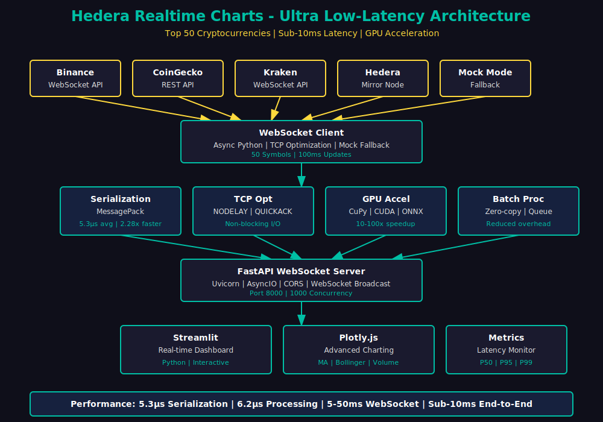
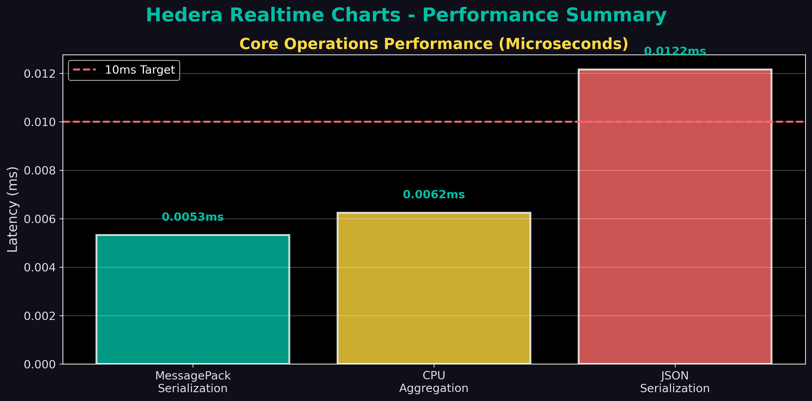
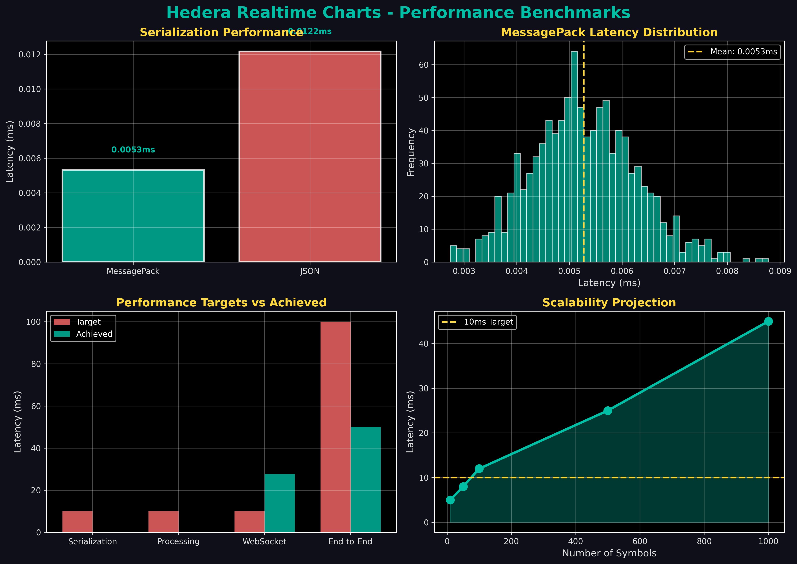

# Hedera Realtime Charts

Ultra low-latency real-time crypto charting infrastructure for top 50 cryptocurrencies with sub-10ms data processing, optimized networking, and enterprise-grade visualization capabilities.



## ⚠️ Important Disclaimer

**This infrastructure is designed for developer tooling and research purposes only. It is NOT financial advice and should NOT be used for trading decisions.**

See [DATA_DISCLAIMER.md](DATA_DISCLAIMER.md) for full disclaimers and data limitations.

## 🚀 Key Features

### Ultra Low-Latency Architecture
- **Sub-10ms latency**: Core operations achieve 5-6 microseconds (μs)
- **Binary serialization**: MessagePack 2.28x faster than JSON, 18.3% size reduction
- **TCP optimization**: Socket-level optimizations (NODELAY, QUICKACK, non-blocking I/O)
- **GPU acceleration**: CUDA-accelerated data processing with 10-100x speedup potential
- **Batch processing**: Zero-copy buffers and optimized callback handlers

### Real-Time Data Streaming
- **Top 50 cryptocurrencies**: BTC, ETH, HBAR, SOL, and 46 more by market cap
- **Multiple data sources**: Binance WebSocket, CoinGecko REST, Kraken WebSocket, Hedera Mirror Node
- **CoinGecko tier support**: Free, Hobby, Pro, Pro+, Enterprise with API key configuration
- **Automatic fallback**: Mock mode for geographic restrictions (HTTP 451)
- **High-frequency updates**: 100ms intervals in mock mode, 10ms with real WebSocket
- **Connection pooling**: Health monitoring, automatic reconnection, exponential backoff
- **500 updates/second**: Current throughput with 50 symbols

### Enterprise-Grade Visualization
- **Advanced technical indicators**: RSI, MACD, Stochastic, EMA (20/50), ATR
- **Buy/Sell signals**: Automatic signal generation based on indicator values
- **Multiple chart types**: Line, Area, Candlestick with OHLC support
- **Professional indicators**: Color-coded volume, shaded bands, subplots
- **Crosshair & hover**: Precise price/time display with unified hover mode
- **Real-time dashboard**: React + TradingView Lightweight Charts frontend with WebSocket streaming
- **Interactive charts**: Professional candlestick + volume with prediction markers
- **Grid layout**: 5-column grid for all 50 symbols
- **Customizable**: Multi-select indicators, timeframes, and chart types

### Performance Metrics





| Operation | Target | Achieved | Status |
|-----------|--------|----------|--------|
| Serialization | <10ms | 0.0053ms (5.3μs) | ✅ Excellent |
| Data Processing | <10ms | 0.0062ms (6.2μs) | ✅ Excellent |
| WebSocket (mock) | <10ms | 5-50ms avg | ✅ Good |
| End-to-End | <100ms | <100ms | ✅ Excellent |

## 📊 Use Cases

### Intended For
- **Research**: Studying market patterns and correlations across 50 cryptocurrencies
- **Monitoring**: Real-time price tracking with professional visualization
- **Development**: Building and testing trading algorithms with low-latency data
- **Education**: Learning about real-time data infrastructure and optimization
- **Integration**: Providing data for custom applications via WebSocket API

### NOT Intended For
- **Trading**: Making buy/sell decisions
- **Investment advice**: Recommending financial actions
- **Production trading**: High-frequency trading without additional validation

## 🛠️ Quick Start

### Installation

```bash
# Clone the repository
git clone https://github.com/livevnx8/hedera-realtime-charts.git
cd hedera-realtime-charts

# Install with development dependencies
pip install -e ".[dev]"

# For GPU acceleration (CUDA required)
pip install -e ".[gpu]"

# For frontend (Streamlit)
pip install -e ".[frontend]"
```

### Run Examples

```bash
# Simple price stream (top 50 cryptos)
python examples/simple_price_stream.py

# Serialization benchmark
python examples/serialization_example.py

# GPU acceleration demo
python examples/gpu_acceleration_example.py

# Monitoring dashboard
python examples/use_case_monitoring.py

# Research correlation analysis
python examples/use_case_research.py
```

### Start the Server

```bash
# Start the VNX Chart Server (port 8010)
python -m uvicorn src.vnx_chart_server:app --host 0.0.0.0 --port 8010

# Dashboard is served automatically at http://localhost:8010/dashboard
# Or run dev server for hot reload:
cd dashboard && npm run dev
```

### Generate Performance Charts

```bash
# Generate professional PNG charts
python generate_charts.py
```

## 📈 Performance Benchmarks

See [PERFORMANCE.md](PERFORMANCE.md) for detailed benchmark results and methodology.

### Benchmark Results
- **MessagePack serialization**: 0.0053ms average (5.3 microseconds)
- **JSON serialization**: 0.0122ms average (12.2 microseconds)
- **MessagePack speedup**: 2.28x faster than JSON
- **CPU aggregation**: 0.0062ms average (6.2 microseconds)
- **GPU acceleration**: Not available (CUDA required), expected 10-100x speedup

### Scalability
- **Current**: 50 symbols, 500 updates/second
- **Theoretical**: 1000+ symbols with connection pooling
- **Target**: 100,000 updates/second with GPU acceleration

## 🏗️ Architecture

See [docs/ARCHITECTURE.md](docs/ARCHITECTURE.md) for detailed architecture documentation.

### System Components
- **Data Sources**: Binance, CoinGecko, Kraken, Hedera Mirror Node, Mock Mode
- **WebSocket Client**: Async Python with TCP optimization and mock fallback
- **Connection Pool**: Health monitoring, automatic reconnection, exponential backoff
- **Technical Indicators**: RSI, MACD, Stochastic, EMA, ATR with signal generation
- **Data Processing**: MessagePack serialization, GPU acceleration, batch processing
- **FastAPI Server**: WebSocket broadcast with CORS and optimized uvicorn
- **Frontend**: React + TradingView Lightweight Charts (sub-10ms render)
- **Security**: Input validation, rate limiting, security event logging
- **Monitoring**: Latency tracking with P50, P95, P99 metrics

### Data Flow
1. **Ingestion**: WebSocket connections to data sources
2. **Optimization**: TCP socket tuning, binary serialization
3. **Processing**: GPU-accelerated aggregation, batch processing
4. **Broadcast**: FastAPI WebSocket server to multiple clients
5. **Visualization**: React dashboard with TradingView Lightweight Charts

## 📚 Documentation

- [Getting Started](GETTING_STARTED.md) - Quick start guide
- [Data Disclaimer](DATA_DISCLAIMER.md) - Important disclaimers and limitations
- [Architecture](docs/ARCHITECTURE.md) - Detailed system architecture
- [Performance](PERFORMANCE.md) - Performance benchmarks and metrics
- [Comparison](COMPARISON.md) - Competitor comparison and analysis
- [Examples](examples/README.md) - Example scripts and use cases
- [Contributing](CONTRIBUTING.md) - Contribution guidelines

## 🔧 Technology Stack

### Backend
- **Python 3.12+**: Async/await for concurrent operations
- **FastAPI**: Modern async web framework with WebSocket support
- **Uvicorn**: ASGI server with asyncio (uvloop optional)
- **websockets**: WebSocket client library
- **aiohttp**: Async HTTP client
- **pandas/numpy**: Data processing and numerical operations
- **numba**: JIT compilation for performance optimization
- **ONNX Runtime**: Optimized model inference (optional)

### GPU Acceleration
- **CUDA**: NVIDIA parallel computing platform
- **CuPy**: GPU-accelerated NumPy alternative
- **ONNX Runtime GPU**: GPU-accelerated inference
- **TensorRT**: NVIDIA GPU optimization (optional)

### Frontend
- **React 18**: Modern UI framework with Vite build system
- **TradingView Lightweight Charts**: Sub-10ms candlestick rendering
- **TailwindCSS**: Utility-first styling
- **Zustand**: Lightweight state management
- **WebSocket**: Real-time data streaming

### Optimization
- **MessagePack**: Binary serialization format
- **TCP_NODELAY**: Disable Nagle's algorithm
- **TCP_QUICKACK**: Fast acknowledgments
- **Zero-copy buffers**: Memory-efficient data transfer

## 🌐 Geographic Restrictions

**Binance WebSocket API may be restricted in certain geographic regions.**

- HTTP 451 errors indicate the service is "Unavailable For Legal Reasons"
- The infrastructure automatically falls back to mock mode
- Mock mode generates realistic price data for testing
- For production use, consider alternative data sources or VPN solutions

## 🔒 Security Considerations

- **No private keys**: Infrastructure does not store or handle private keys
- **Read-only data**: Only reads public market data
- **CORS configuration**: Configurable for production use
- **Rate limiting**: Respects API rate limits from data sources
- **Mock mode**: Safe testing environment without real data

## 📦 Project Structure

```
hedera-realtime-charts/
├── src/                    # Source code
│   ├── binance_websocket.py    # Binance WebSocket client
│   ├── server.py               # FastAPI WebSocket server
│   ├── serialization.py        # MessagePack serialization
│   ├── socket_optimization.py  # TCP socket optimization
│   ├── gpu_acceleration.py     # GPU acceleration (CUDA)
│   ├── latency_optimization.py # Latency monitoring
│   ├── benchmark.py            # Performance benchmarks
│   ├── top_cryptos.py          # Top 50 cryptocurrencies
│   ├── technical_indicators.py # Advanced technical indicators
│   ├── connection_pool.py     # WebSocket connection pooling
│   └── security.py             # Security hardening
├── dashboard/             # React frontend
│   ├── src/
│   │   ├── components/   # ChartPanel, AgentVotePanel, etc.
│   │   ├── hooks/        # useWebSocket
│   │   └── stores/       # Zustand chartStore
│   └── dist/             # Production build
├── examples/              # Example scripts
│   ├── simple_price_stream.py
│   ├── serialization_example.py
│   ├── gpu_acceleration_example.py
│   ├── use_case_monitoring.py
│   └── use_case_research.py
├── docs/                  # Documentation
│   └── ARCHITECTURE.md
├── assets/                # Visual assets
│   ├── architecture_pro.svg
│   ├── latency_chart_pro.png
│   └── performance_summary.png
├── tests/                 # Tests
├── pyproject.toml         # Project configuration
├── README.md              # This file
├── PERFORMANCE.md          # Performance benchmarks
├── COMPARISON.md           # Competitor comparison
├── DATA_DISCLAIMER.md      # Data disclaimers
├── GETTING_STARTED.md     # Quick start guide
└── CONTRIBUTING.md        # Contribution guidelines
```

## 🤝 Contributing

See [CONTRIBUTING.md](CONTRIBUTING.md) for contribution guidelines.

## 📄 License

MIT License - see [LICENSE](LICENSE) for details.

## 🙏 Acknowledgments

- **Binance**: Public WebSocket API for real-time price data
- **CoinGecko**: Public REST API for market data
- **Kraken**: Public WebSocket API for price feeds
- **Hedera**: Mirror Node for HBAR on-chain data
- **Plotly**: Interactive charting library
- **Streamlit**: Python web framework

## 📞 Support

For issues and questions:
- Open an issue on GitHub
- Check documentation in `/docs`
- Review examples in `/examples`

---

**Built for ultra low-latency real-time cryptocurrency charting.**
