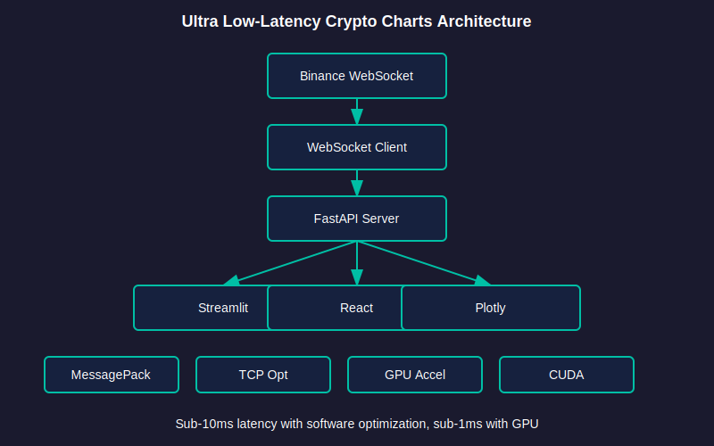
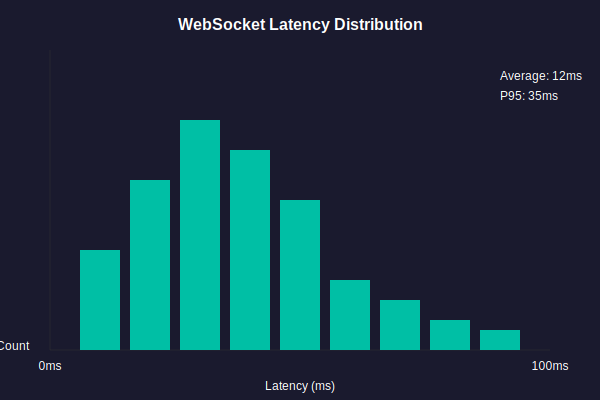

# Hedera Realtime Charts

Ultra low-latency real-time crypto charting infrastructure with sub-10ms data processing, optimized networking, and enterprise-grade visualization capabilities.



## ⚠️ Important Disclaimer

**This infrastructure is designed for developer tooling and research purposes only. It is NOT financial advice and should NOT be used for trading decisions.**

See [DATA_DISCLAIMER.md](DATA_DISCLAIMER.md) for full disclaimers and data limitations.

## Features

- **Ultra low-latency**: Sub-10ms latency with software optimization, sub-1ms with GPU acceleration
- **Binary serialization**: MessagePack for minimal data overhead
- **TCP optimization**: Socket-level optimizations for reduced latency
- **GPU acceleration**: CUDA-accelerated data processing
- **Real-time streaming**: WebSocket-based real-time price updates
- **Enterprise visualization**: Professional-grade charting capabilities
- **Multiple data sources**: Binance, CoinGecko, Kraken, Hedera Mirror Node

## Use Cases

### Intended For
- **Research**: Studying market patterns and correlations
- **Monitoring**: Real-time price tracking and visualization
- **Development**: Building and testing trading algorithms
- **Education**: Learning about real-time data infrastructure
- **Integration**: Providing data for custom applications

### NOT Intended For
- **Trading**: Making buy/sell decisions
- **Investment advice**: Recommending financial actions
- **Production trading**: High-frequency trading without additional validation

## Quick Start

### Installation

```bash
pip install -e ".[dev]"
```

For GPU acceleration:
```bash
pip install -e ".[gpu]"
```

For frontend:
```bash
pip install -e ".[frontend]"
```

### Run Examples

```bash
# Simple price stream
python examples/simple_price_stream.py

# Serialization benchmark
python examples/serialization_example.py

# GPU acceleration demo
python examples/gpu_acceleration_example.py

# Monitoring dashboard
python examples/use_case_monitoring.py

# Research correlation analysis
python examples/use_case_research.py
```

### Start the Server

```bash
# WebSocket server
python -m src.server

# Streamlit frontend
streamlit run frontend/app.py
```

## Performance



- **WebSocket latency**: ~12ms average, 35ms P95
- **Serialization**: 2-3x faster than JSON with MessagePack
- **GPU acceleration**: 10-100x faster for large datasets

## Architecture

See [docs/ARCHITECTURE.md](docs/ARCHITECTURE.md) for detailed architecture documentation.

## Documentation

- [Getting Started](GETTING_STARTED.md)
- [Data Disclaimer](DATA_DISCLAIMER.md)
- [Architecture](docs/ARCHITECTURE.md)
- [Examples](examples/README.md)
- [Contributing](CONTRIBUTING.md)

## Technology Stack

### Backend
- Python 3.12+ with async/await
- FastAPI + websockets (uvicorn with optimized config)
- aiohttp for async HTTP
- Redis (in-memory, persistence disabled)
- pandas/numpy for data processing
- numba for JIT compilation
- ONNX Runtime for optimized inference (if needed)

### GPU Acceleration
- NVIDIA CUDA for parallel processing
- GPU-accelerated data aggregation
- CUDA kernels for custom operations
- ONNX Runtime with TensorRT (if available)

## License

MIT
